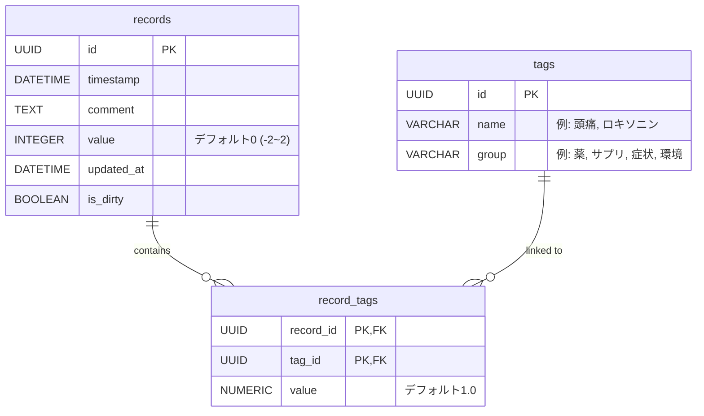

# self-track-v3 詳細設計書

体調管理および行動ログを記録し、行動と体調の因果関係を特定するためのスマートフォンアプリケーション。
本ドキュメントは、要求仕様、データ構造、および画面仕様を含む詳細な設計方針を定義する。

---

## 1. アプリ概要と目的
* **目的**: 自分自身が行った行動（薬の服用、サプリ、運動など）と、身体的・精神的なコンディション（体調値、特定の症状）の因果関係を統計的に特定する。
* **サブ機能**: 日常の出来事や体調のつぶやきを蓄積し、タイムライン型の日記帳としても機能させる。

---

## 2. 要求仕様と用語定義

### 2.1 データ分類
データは統計モデルにおける役割を考慮し、以下のように分類する。

* **`action`（行動 / 主に説明変数 $x$）**
  * 服薬、サプリ摂取、運動、入浴など、ユーザー自身が能動的に行ったアプローチ。
* **`symptom`（症状 / 目的変数 $y$ または説明変数 $x$）**
  * 頭痛、だるさ、かゆみ、不眠など、受動的に発生した身体的・精神的トラブル。
* **`event`（要因・環境 / 説明変数 $x$ または目的変数 $y$）**
  * 天候（雨、気圧低下）、仕事のストレス、旅行などの外部的な状況・出来事。
* **`condition`（体調値 / 主たる目的変数 $y$）**
  * その瞬間の全体的な体調。5段階（-2 〜 2）で記録する。

### 2.2 例外記録（パッシブ・トラッキング）の思想
* アプリの継続率向上のため、**「特に問題がない時は入力しなくてよい」** という思想を採用する。
* ユーザーによる体調値の入力がない場合は、自動的に `0`（普通・平常状態）として処理する。
* 体調が著しく悪い（または良い）場合や、薬を飲んだなどのイベントが発生したタイミングでのみ記録を行う。

---

## 3. データベース設計（テーブル定義）

端末ローカルでの高速な時系列処理とリアクティブなUI更新を実現するため、**SQLite (Drift)** を使用する。

### 3.1 `records` テーブル (体調・コメント親レコード)
ユーザーがその瞬間の状態を記録するテーブル。

| カラム名 | 型 | 制約 | 説明 |
| :--- | :--- | :--- | :--- |
| `id` | UUID (VARCHAR) | PRIMARY KEY | ユニーク識別子 |
| `timestamp` | DATETIME | NOT NULL | 記録日時（秒単位まで保持） |
| `comment` | TEXT | NULLABLE | その時のつぶやき・メモ。日記の要素となる。 |
| `value` | INTEGER | NOT NULL, DEFAULT 0 | その瞬間の体調評価。値は `-2, -1, 0, 1, 2`。 |
| `updated_at` | DATETIME | NOT NULL | 同期制御用の最終更新日時。 |
| `is_dirty` | BOOLEAN | NOT NULL, DEFAULT true | クラウドへの未同期フラグ。 |

### 3.2 `tags` テーブル (タグマスタ)
記録項目（行動、症状、外部要因）を定義するマスタ。

| カラム名 | 型 | 制約 | 説明 |
| :--- | :--- | :--- | :--- |
| `id` | UUID (VARCHAR) | PRIMARY KEY | ユニーク識別子 |
| `name` | VARCHAR | NOT NULL, UNIQUE | タグの表示名（例: "ロキソニン", "頭痛"） |
| `group` | VARCHAR | NOT NULL | UIの整理や分析時の分類（例: "薬", "サプリ", "運動", "症状", "環境"） |

### 3.3 `record_tags` テーブル (中間テーブル)
1つのレコードに複数の行動や症状を紐付けるための交差テーブル。

| カラム名 | 型 | 制約 | 説明 |
| :--- | :--- | :--- | :--- |
| `record_id` | UUID (VARCHAR) | PRIMARY KEY, FK | `records.id` への参照 (ON DELETE CASCADE) |
| `tag_id` | UUID (VARCHAR) | PRIMARY KEY, FK | `tags.id` への参照 |
| `value` | NUMERIC | NOT NULL, DEFAULT 1.0 | 記録の強さや量（例: 薬なら「2.0」錠、運動強度なら「3.0」） |

---

## 4. 計算・可視化アルゴリズム

### 4.1 時間経過による「0（平常）への減衰」処理
データ間のギャップを補完し、スコアの高止まり・低止まりを防ぐため、**「12時間以上ログがない場合は平常（0）に戻る」** という仮想プロット処理を計算・描画の実行時にメモリ上で行う。

1. **隣り合うログ間の処理**:
   * 隣り合うログ $A$ と $B$ の時間差 $T_{B} - T_{A}$ が12時間を超える場合、時刻 $T_{A} + 12$ 時間の位置に `value = 0` の**仮想ポイント（Virtual Point）**を挿入する。
2. **直近（未来）の処理**:
   * 最後のログ $L$ から現在時刻 $now$ までの時間差が12時間を超える場合、時刻 $T_{L} + 12$ 時間の位置に `value = 0` の仮想ポイントを挿入し、現在時刻 $now$ における点も `value = 0` として扱う。

### 4.2 日次スコアの積分（AUC）計算
カレンダー表示や統計処理で用いる「その日の総合体調スコア」は、体調値を結んだ線の**積分値（曲線下面積：AUC）**として計算する。

* **表示（UI）**: グラフ描画ライブラリ（`fl_chart`）の機能を用いて、データポイントをなめらかな曲線（スプライン補間）で描画する。
* **計算（ロジック）**: 処理速度と数値の安定性（オーバーシュートの防止）のため、**台形公式（Trapezoidal Rule）**を用いて線形積分値を算出する。

$$Score_{day} = \int_{00:00}^{24:00} f(t) dt \approx \sum_{i} \frac{v_i + v_{i+1}}{2} \times \Delta t_i$$

* **0:00 時点の補間**: 1日の開始（00:00）時点の体調値は、前日の最終レコードと当日の最初のレコードを結ぶ線から線形補間（または12時間減衰を考慮した値）して算出する。

---

## 5. UI（画面仕様）

### 5.1 Track（体調記録画面）
* **機能**: その瞬間の体調値、タグ、コメントを記録する。
* **UI構造**: 
  * メイン画面は本日のタイムライン（記録履歴）を表示。
  * `+` ボタンを押すと、下部から「上伸びパネル（Composer）」がせり出す。
  * パネル内で体調値の5段階ボタン（最悪〜最高）を選択し、アコーディオン形式で展開するタグエリアからタグをタップして選択する。
  * コメントを入力し、送信ボタン（↑）を押すと1つの `record` が作成される。

### 5.2 Calendar（カレンダー画面）
* **機能**: 月単位で体調の変遷を俯瞰する。
* **可視化**:
  * **背景色（ヒートマップ）**: 各マスの背景色は、その日の「日次積分スコア（$-2 \sim 2$）」に応じたグラデーションカラー（悪い: 赤系 $\rightarrow$ 普通: グレー系 $\rightarrow$ 良い: 青・緑系）で塗りつぶされる。
  * **ドットインジケータ**: マスの内部に、その日に記録されたタグのカテゴリ（例: 症状なら赤ドット、行動なら青ドット）を小さな丸で表示し、何があった日なのかを一目でわかるようにする。
  * **日記ビュー**: 日付セルをタップすると、下部にその日のタイムライン（各 `record` の時刻、コメント、タグ）がカード形式で一覧表示され、1日の日記として読める。

### 5.3 Stats（統計表示画面）
* **機能**: 蓄積されたデータから因果関係や相関関係をグラフと数値で可視化する。
* **可視化項目**:
  * 直近数日間の体調スコアの推移グラフ。
  * どの行動（`action`）がどの症状（`symptom`/`condition`）の改善・悪化に寄与したかの相関分析。
  * ※詳細は追って策定。

### 5.4 Tags（タグ管理画面）
* **機能**: タグマスタの編集。
* **UI**: 登録済みタグのリスト表示。新規タグの追加（名前と所属グループの登録）、不要なタグの削除。

### 5.5 Settings（設定画面）
* **機能**: バックアップやアプリ全般の設定。
* **UI**: 手動バックアップの実行、データのエクスポート/インポート、データの全削除など。
