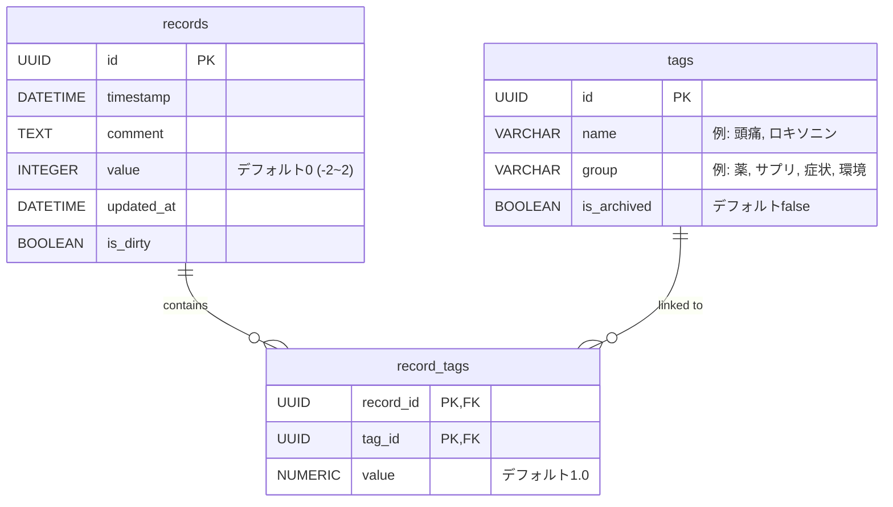

# self-track-v3 v1.0 仕様書

本書を製品仕様・データ設計・画面仕様・実装計画の唯一の正本とする。
実行可能なフロントエンドモックは `docs/frontend-spec.html` とし、本書と矛盾する場合は本書を優先する。

## 文書とモックの確認方法

- 仕様を変更するときは本書と `docs/frontend-spec.html` を同じコミットで更新する。
- ローカルUIの目視確認には Codex アプリ内Browserではなく、standalone Playwrightを使う。
- スクリーンショットは次のコマンドで作成する。

```bash
node /Users/tau/.codex/browser-runtime/screenshot.mjs \
  /Users/tau/repo/dev/self-track-v3/docs/frontend-spec.html \
  /tmp/self-track-v3-frontend-spec.png
```

## 統合時に確定した仕様

旧 `design.md`、`plan.md`、`draft.md` およびフロントエンドモック間で異なっていた項目は、v1.0 では次のように統一する。

- **無記録時間と無記録日は区別する**: condition曲線上の無記録時間は12時間で0へ減衰する。一方、実レコードが1件もない日は日次スコアを `null` とし、Calendarでは空白、月次・週次集計からは除外する。
- **未来の記録で過去を補間しない**: 0へ減衰した後は次の実レコード時刻まで0を維持し、次の実レコード値はその時刻から有効とする。
- **Calendarは日次AUCの単色表示**: 単一・複数レコードを問わず同じ日次AUCを5段階に丸め、1日1色のドットで表示する。多色リング案は採用しない。
- **過去日は閲覧専用**: 新規記録の `timestamp` は常に端末の現在日時とする。過去日表示中にComposerを開いた場合も過去日へ新規作成しない。
- **タググループはv1.0では固定**: `症状`、`薬`、`サプリ`、`運動`、`環境` の5種類とする。分析上は順に `symptom`、`action`、`action`、`action`、`event` へ対応させる。
- **関連分析の母集団は分析期間の全暦日**: 最初の日から最後の日までの全日を2×2表に含める。実レコードのない日はタグ発生なしとして扱う。
- **データ不足は3回未満**: actionまたはsymptomの発生日数が3日未満なら、リフト値・オッズ比・p値をマスクする。
- **全データ消去は全3テーブルが対象**: `record_tags`、`records`、`tags` を同一トランザクションで消去する。
- **ダークモードはモック閲覧機能のみ**: `frontend-spec.html` のテーマ切替は仕様書閲覧用であり、Flutterアプリv1.0の機能には含めない。

---

# 第I部: 製品・詳細設計

体調管理および行動ログを記録し、行動と体調の因果関係を特定するためのスマートフォンアプリケーション。
本ドキュメントは、要求仕様、データ構造、および画面仕様を含む詳細な設計方針を定義する。

---

## 1. アプリ概要と目的
* **目的**: 自分自身が行った行動（薬の服用、サプリ、運動など）と、身体的・精神的なコンディション（体調値、特定の症状）の因果関係を統計的に特定する。
* **サブ機能**: 日常の出来事や体調のつぶやきを蓄積し、タイムライン型の日記帳としても機能させる。

### 1.1 v1.0 スコープ
v1.0 は「main にマージできる、動作するシンプルなバージョン」とする。

**含めるもの**:
* **Track**: 記録の作成、当日タイムライン表示、長押しによる記録の編集・削除。
* **Tags**: タグの追加・編集、アーカイブ（削除の代替）。
* **Calendar**: 月表示と簡易統計。
* **Stats**: フェーズ1（イベントロック平均、オッズ比+Fisher、リフト値）の簡易表示。分析機能の感触を確認することが目的。
* **Settings**: データ全削除のみの最小構成。

**含めないもの（将来バージョン）**:
* クラウド同期・バックアップ（同期用カラム `updated_at` / `is_dirty` はスキーマにのみ用意しておく）。
* `record_tags.value`（量・強度）の入力UI。v1.0 では一律 `1.0` 固定で記録する。
* 統計フェーズ2以降。
* データのエクスポート/インポート。

---

## 2. 要求仕様と用語定義

### 2.1 データ分類
データは統計モデルにおける役割を考慮し、以下のように分類する。

* **`action`（行動 / 主に説明変数 $x$）**
  * 服薬、サプリ摂取、運動、入浴など、ユーザー自身が能動的に行ったアプローチ。
* **`symptom`（症状 / 目的変数 $y$ または説明変数 $x$）**
  * 頭痛、だるさ、かゆみ、不眠など、受動的に発生した身体的・精神的トラブル。
* **`event`（要因・環境 / 説明変数 $x$ または目的変数 $y$）**
  * 天候（雨、気圧低下）、仕事のストレス、旅行などの外部的な状況・出来事。
* **`condition`（体調値 / 主たる目的変数 $y$）**
  * その瞬間の全体的な体調。5段階（-2 〜 2）で記録する。

### 2.2 例外記録（パッシブ・トラッキング）の思想
* アプリの継続率向上のため、**「特に問題がない時は入力しなくてよい」** という思想を採用する。
* condition曲線上でユーザーの入力がない時間は、直前値から12時間で `0`（普通・平常状態）へ減衰させる。12時間経過後は次の実レコードまで0を維持する。
* 体調が著しく悪い（または良い）場合や、薬を飲んだなどのイベントが発生したタイミングでのみ記録を行う。
* 服薬などの行動を記録する際も、体調値は常にレコードに含まれる。体調が普通であれば入力を省略でき、その場合デフォルトの `0`（平常）が記録される。つまり「体調0 + 行動タグ」のレコードは「平常時にその行動をした」という意味を持つ。**「未評価」という状態は存在しない**ため、`records.value` は NOT NULL のままでよい。
* `records.value` に未評価値は設けないが、実レコードが1件もない日の日次スコアはデータの有無を表すため `null` とする。これはcondition値の未評価とは別概念である。

---

## 3. データベース設計（テーブル定義）

端末ローカルでの高速な時系列処理とリアクティブなUI更新を実現するため、**SQLite (Drift)** を使用する。



### 3.1 `records` テーブル (体調・コメント親レコード)
ユーザーがその瞬間の状態を記録するテーブル。

| カラム名 | 型 | 制約 | 説明 |
| :--- | :--- | :--- | :--- |
| `id` | UUID (VARCHAR) | PRIMARY KEY | ユニーク識別子 |
| `timestamp` | DATETIME | NOT NULL | 記録日時（秒単位まで保持） |
| `comment` | TEXT | NULLABLE | その時のつぶやき・メモ。日記の要素となる。 |
| `value` | INTEGER | NOT NULL, DEFAULT 0 | その瞬間の体調評価。値は `-2, -1, 0, 1, 2`。 |
| `updated_at` | DATETIME | NOT NULL | 同期制御用の最終更新日時。 |
| `is_dirty` | BOOLEAN | NOT NULL, DEFAULT true | クラウドへの未同期フラグ。 |

### 3.2 `tags` テーブル (タグマスタ)
記録項目（行動、症状、外部要因）を定義するマスタ。

| カラム名 | 型 | 制約 | 説明 |
| :--- | :--- | :--- | :--- |
| `id` | UUID (VARCHAR) | PRIMARY KEY | ユニーク識別子 |
| `name` | VARCHAR | NOT NULL, UNIQUE | タグの表示名（例: "ロキソニン", "頭痛"） |
| `group` | VARCHAR | NOT NULL | v1.0では `薬`、`サプリ`、`運動`、`症状`、`環境` のいずれか。分析上の役割は §2.1 と「統合時に確定した仕様」の対応表に従う。 |
| `is_archived` | BOOLEAN | NOT NULL, DEFAULT false | アーカイブフラグ。タグの削除は物理削除ではなくアーカイブで行い、過去の記録（`record_tags`）は保持する。アーカイブされたタグは Track のタグ選択候補に表示されない。 |

### 3.3 `record_tags` テーブル (中間テーブル)
1つのレコードに複数の行動や症状を紐付けるための交差テーブル。

| カラム名 | 型 | 制約 | 説明 |
| :--- | :--- | :--- | :--- |
| `record_id` | UUID (VARCHAR) | PRIMARY KEY, FK | `records.id` への参照 (ON DELETE CASCADE) |
| `tag_id` | UUID (VARCHAR) | PRIMARY KEY, FK | `tags.id` への参照 |
| `value` | NUMERIC | NOT NULL, DEFAULT 1.0 | 記録の強さや量（例: 薬なら「2.0」錠、運動強度なら「3.0」）。v1.0 では入力UIを設けず一律 `1.0` で記録する。 |

---

## 4. 計算・可視化アルゴリズム

### 4.1 時間経過による「0（平常）への減衰」処理
データ間のギャップを補完し、スコアの高止まり・低止まりを防ぐため、**「12時間以上ログがない場合は平常（0）に戻る」** という仮想プロット処理を計算・描画の実行時にメモリ上で行う。

1. **隣り合うログ間の処理**:
   * 隣り合うログ $A$ と $B$ の時間差 $T_{B} - T_{A}$ が12時間を超える場合、時刻 $T_{A} + 12$ 時間の位置に `value = 0` の**仮想ポイント（Virtual Point）**を挿入する。
   * 仮想ポイントから次の実レコード $B$ の直前までは `value = 0` を維持する。$B$ の値を過去方向へ線形補間してはならない。
2. **直近（未来）の処理**:
   * 最後のログ $L$ から現在時刻 $now$ までの時間差が12時間を超える場合、時刻 $T_{L} + 12$ 時間の位置に `value = 0` の仮想ポイントを挿入し、現在時刻 $now$ における点も `value = 0` として扱う。

### 4.2 日次スコアの積分（AUC）計算
カレンダー表示や統計処理で用いる「その日の総合体調スコア」は、体調値を結んだ線の**積分値（曲線下面積：AUC）**として計算する。

* **表示（UI）**: グラフ描画ライブラリ（`fl_chart`）の機能を用いて、データポイントをなめらかな曲線（スプライン補間）で描画する。
* **計算（ロジック）**: 処理速度と数値の安定性（オーバーシュートの防止）のため、**台形公式（Trapezoidal Rule）**を用いて線形積分値を算出する。

$$Score_{day} = \int_{00:00}^{24:00} f(t) dt \approx \sum_{i} \frac{v_i + v_{i+1}}{2} \times \Delta t_i$$

* **積分区間**: 端末ローカル時刻の `[00:00, 翌日00:00)` とする。終端は23:59:59ではなく翌日00:00を使う。
* **0:00 時点の値**: 前日の最終レコードから12時間以内なら0への減衰線上の値、それ以外は0とする。当日の最初のレコードを過去方向へ補間しない。
* **無記録日**: 対象日に実レコードが1件もなければ日次スコアは `null` とし、Calendarの表示・月次割合・7日平均から除外する。
* **単一レコード日**: 生のレコード値を日次値にはせず、0:00境界、実レコード、12時間減衰、翌日0:00境界を用いて複数レコード日と同じ台形積分を行う。
* **日付への帰属**: レコードは `timestamp`（端末ローカル時刻）が属する日にそのまま帰属させる。深夜帯の記録を前日扱いにするなどの特例は設けない。タイムゾーンも端末ローカルに従う。

### 4.3 統計分析手法（Stats機能）
`action`/`event`/`symptom`（タグ）と `condition`（連続値）の因果的寄与を、分析のカバレッジを上げつつ段階的に整備する。単純なPearson相関を主指標として採用しない理由は、複数タグの同時発生による交絡と時間ラグを考慮できないため。

#### 共通基盤：時間窓集計
すべての手法の土台として、「タグ発生時刻を起点に、一定の時間窓（例: 0-3h/3-6h/6-12h、4.1の12時間減衰と整合させる）で集計する」処理を共通化する。この基盤の上に指標を追加していくことで、後続手法の実装コストを抑える。

#### フェーズ1（v1.0 に含める）
* **イベントロック平均**: タグ発生時刻を0として前後の`condition`推移を全発生回数分重ねて平均し、ベースライン（減衰モデルの0点）との差分を可視化する。連続値との関係を見る主軸。
* **オッズ比 + Fisherの正確確率検定**: `action`タグ×`symptom`タグの二値関連を2×2分割表で評価する。正規近似に頼らないため、発生回数が少ないタグでも成立し、少数データに強い。
* **リフト値**: `P(症状|行動) / P(症状)` としてユーザー向け表示に用いる（オッズ比より直感的だが検定には不向き）。
* **観測期間**: 選択した分析期間の全暦日を母集団とする。日単位の関連分析では無記録日も「タグ発生なし」の日として2×2分割表へ含める。
* **タグの役割**: `薬`、`サプリ`、`運動` をaction、`症状`をsymptomとする。`環境`はeventとしてイベントロック平均の対象には含めるが、v1.0のaction×symptom関連リストには混在させない。
* **データ不足**: actionまたはsymptomの発生日数が3日未満の組は、数値を表示せず「データ不足」とする。

#### フェーズ2
* **正則化重回帰（Ridge/Lasso）**: 時間窓ごとのタグ発生をラグ特徴量化し、`condition`に対して回帰することで、同時発生する他タグの影響を制御しつつ寄与度を定量化する。データが蓄積してから導入する。

#### フェーズ3（将来拡張）
* **ラグ付き交差相関**: フェーズ1のイベントロック平均を一般化し、最適な効果ラグτを自動探索する。`condition`は自己相関が強い（なめらかに減衰する）ため、生値ではなく差分系列（Δy）に対して計算し、擬似相関を避ける。
* **ベイズ階層モデル**: タグごとの発生回数差（数回〜数百回）を縮小推定で扱い、信用区間を提示する。MCMC実装はオンデバイスでは重いため、データ量が増えた段階でEmpirical Bayes等の簡易版から検討する。

---

## 5. UI（画面仕様）

### 5.1 Track（体調記録画面）
* **機能**: その瞬間の体調値、タグ、コメントを記録する。
* **UI構造**: 
  * メイン画面は本日のタイムライン（記録履歴）を表示。
  * `+` ボタンを押すと、下部から「上伸びパネル（Composer）」がせり出す。
  * パネル内で体調値の5段階ボタン（最悪〜最高）を選択し、アコーディオン形式で展開するタグエリアからタグをタップして選択する。タグ選択はオン/オフのみで、量・強度の入力UIは設けない（`record_tags.value` は一律 `1.0`）。
  * コメントを入力し、送信ボタン（↑）を押すと1つの `record` が作成される。
* **編集・削除**: タイムライン上の記録を**長押し**すると編集・削除のメニューを表示する。誤操作（暴発）を防ぐため、タップではなく長押しとする。
* **過去日表示**: Calendarから遷移した過去日は閲覧専用とする。新規記録は常に現在日時で作成し、過去日へは作成しない。
* **削除確認**: 削除はアクションメニューから即時実行せず、確認ダイアログで再確認する。
* **タグ未登録時**: 登録済みタグ（アーカイブ済みを除く）が1つも存在しない場合、Composer のタグ追加ボタンは非表示にする。

### 5.2 Calendar（カレンダー画面）
* **機能**: 月単位で体調の変遷を俯瞰する。
* 月グリッドは日次AUCを5段階へ丸めた単色ドットと日付を表示する。多色リングは採用しない。
* 実レコードがない日は空白とし、月次割合・月平均・7日平均・前期間比較の分母から除外する。

### 5.3 Stats（統計表示画面）
* **機能**: 蓄積されたデータから因果関係や相関関係をグラフと数値で可視化する。
* **可視化項目**:
  * 直近数日間の体調スコアの推移グラフ。
  * どの行動（`action`）がどの症状（`symptom`/`condition`）の改善・悪化に寄与したかの相関分析。
  * 分析手法の詳細は「4.3 統計分析手法（Stats機能）」を参照。

### 5.4 Tags（タグ管理画面）
* **機能**: タグマスタの編集。
* **UI**: 登録済みタグのリスト表示。新規タグの追加（名前と固定5グループの選択）、タグの編集。同名タグはUNIQUE制約により拒否し、理由を表示する。
* **削除（アーカイブ）**: タグの削除は物理削除ではなくアーカイブとする。アーカイブされたタグは Track の選択候補から消えるが、過去の記録は保持され、統計にも引き続き利用できる。アーカイブの解除も可能とする。

### 5.5 Settings（設定画面）
* **v1.0 の機能**: データの全削除のみ。バックアップおよびエクスポート/インポートは将来バージョンで対応する。
* **全削除対象**: `record_tags`、`records`、`tags` の全行。2段階確認後、同一トランザクションで消去する。

---

# 第II部: v1.0 実装計画

第I部（特に §1.1 v1.0 スコープ）を実装に落とすための計画書。
v1.0 のゴールは **「main にマージできる、動作するシンプルなバージョン」** であり、Track / Tags / Calendar / Stats（フェーズ1）/ 最小 Settings を含む。

---

## 1. 技術スタックの確定

| 項目 | 採用 | 理由・補足 |
| :--- | :--- | :--- |
| フレームワーク | Flutter (stable) | Android 主眼、iOS 互換（第I部の既定） |
| ローカルDB | Drift (SQLite) | リアクティブな `watch()` ストリームで UI 更新（第I部の既定） |
| 状態管理 | Riverpod (`flutter_riverpod`) | Drift のストリームを `StreamProvider` に流すだけで画面が追従する。規模的に BLoC は過剰 |
| グラフ | `fl_chart` | 体調推移のスプライン描画、カレンダー下部のドーナツ/スパークライン（第I部の既定） |
| ID生成 | `uuid` | UUID v4 を TEXT 主キーとして保存 |
| 日付処理 | `intl` | 表示フォーマットのみ。タイムゾーンは端末ローカルに従い変換しない |
| ナビゲーション | 標準 `Navigator` + `Drawer` | モックのハンバーガーメニュー（☰）から5画面を切替。ルーティングライブラリは導入しない |
| Lint | `flutter_lints`（デフォルト） | 追加ルールは入れない |

統計計算（Fisher の正確確率検定など）は依存を増やさず自前実装する（§6.3 参照）。

## 2. ディレクトリ構成

```
lib/
├── main.dart
├── data/                    # 永続化層
│   ├── database.dart        # Drift データベース定義（テーブル・接続）
│   ├── tables.dart          # Records / Tags / RecordTags テーブル
│   └── daos/
│       ├── records_dao.dart # レコードCRUD + タグ紐付け + 期間クエリ
│       └── tags_dao.dart    # タグCRUD + アーカイブ
├── domain/                  # 純粋ロジック層（Flutter非依存・全て単体テスト対象）
│   ├── models.dart          # RecordWithTags などのUI向けモデル
│   ├── condition_series.dart# 12時間減衰の仮想ポイント挿入（第I部 §4.1）
│   ├── daily_score.dart     # 台形公式によるAUC・日次スコア（第I部 §4.2）
│   └── stats/
│       ├── time_window.dart # 時間窓集計の共通基盤（第I部 §4.3）
│       ├── event_locked.dart# イベントロック平均
│       ├── contingency.dart # 2×2分割表・オッズ比・リフト値
│       └── fisher.dart      # Fisherの正確確率検定（自前実装）
├── providers/               # Riverpodプロバイダ（DB・DAO・画面状態）
└── ui/
    ├── app.dart             # MaterialApp / Drawer / 画面切替
    ├── theme.dart           # 体調5段階カラー等の定数
    ├── track/               # Track画面（タイムライン + Composer）
    ├── calendar/            # Calendar画面
    ├── stats/               # Stats画面
    ├── tags/                # Tags画面
    └── settings/            # Settings画面
```

方針: **domain/ は Flutter に依存させない**。減衰・AUC・統計はすべて純 Dart 関数とし、単体テストで固める。UI は Drift ストリーム + domain 関数の合成に徹する。

## 3. 共通仕様の確定事項

### 3.1 体調値のマッピング
- DB は第I部の定義どおり `-2〜2`（DEFAULT 0）で保存する。
- UI は `1〜5` で表示する（`ui = db + 3`）。変換は UI 層（theme.dart 付近の定数・関数）でのみ行い、domain/ と data/ は常に `-2〜2` で扱う。

### 3.2 体調5段階カラー（モック準拠）
| UI値 | ラベル | 色 |
| :-- | :-- | :-- |
| 1 | 最悪 | `#EF4444` |
| 2 | 悪い | `#F97316` |
| 3 | 普通 | `#94A3B8` |
| 4 | 良い | `#22C55E` |
| 5 | 最高 | `#3B82F6` |

### 3.3 日時の扱い
- `timestamp` は端末ローカル時刻で保存・解釈する（Drift の DATETIME はエポック秒格納だが、日付への帰属計算はローカル変換後に行う）。
- 日付への帰属は timestamp の属する日そのまま。深夜特例なし（第I部 §4.2）。

## 4. マイルストーン

依存関係順に M0→M7 で進める。各マイルストーンは単独でコミット可能な粒度とし、完了条件（DoD）を満たしてから次へ進む。

### M0: プロジェクト雛形
- `flutter create`（org 等は作成時に決定）、不要なサンプルコード削除。
- 依存パッケージ導入（drift, drift_flutter, flutter_riverpod, fl_chart, uuid, intl / dev: build_runner, drift_dev, flutter_lints）。
- Drawer で5画面（全て仮のプレースホルダ）を切り替えられる骨格。
- **DoD**: Android 実機/エミュレータで起動し5画面を行き来できる。`flutter analyze` がクリーン。

### M1: データ層（Drift）
- 第I部 §3 の3テーブルを定義。スキーマは以下の通り。

```dart
class Records extends Table {
  TextColumn get id => text()();                       // UUID v4
  DateTimeColumn get timestamp => dateTime()();
  TextColumn get comment => text().nullable()();
  IntColumn get value => integer().withDefault(const Constant(0))(); // -2..2
  DateTimeColumn get updatedAt => dateTime()();
  BoolColumn get isDirty => boolean().withDefault(const Constant(true))();
  @override Set<Column> get primaryKey => {id};
}

class Tags extends Table {
  TextColumn get id => text()();
  TextColumn get name => text().unique()();
  TextColumn get group => text().named('tag_group')(); // groupはSQL予約語のため列名を変更
  BoolColumn get isArchived => boolean().withDefault(const Constant(false))();
  @override Set<Column> get primaryKey => {id};
}

class RecordTags extends Table {
  TextColumn get recordId => text().references(Records, #id, onDelete: KeyAction.cascade)();
  TextColumn get tagId => text().references(Tags, #id)();
  RealColumn get value => real().withDefault(const Constant(1.0))(); // v1.0では常に1.0
  @override Set<Column> get primaryKey => {recordId, tagId};
}
```

- インデックス: `records.timestamp`（期間クエリが全画面の基盤になるため）。
- DAO:
  - RecordsDao: 作成（タグ紐付け込みのトランザクション）、更新、削除、`watchByDateRange(from, to)`、全件ストリーム。
  - TagsDao: 作成、更新、アーカイブ/解除、`watchActive()`（選択候補用）、`watchAll()`（Tags画面用）。
- `updatedAt` / `isDirty` は書き込み時に DAO 内で自動設定する（v1.0 で同期はしないが値は正しく維持する）。
- **DoD**: DAO の単体テスト（インメモリSQLite: `NativeDatabase.memory()`）が通る。カスケード削除・UNIQUE制約・アーカイブフィルタを検証。

### M2: Tags 画面
Track がタグ選択に依存するため、UI は Tags から作る。
- 有効タグ一覧 + アーカイブ済み一覧（折りたたみ）のリスト表示。グループごとにセクション分け。
- 新規追加ダイアログ（name 必須・group 必須）。group はv1.0固定の5グループから選択する。
- 編集（name / group 変更）、アーカイブ、アーカイブ解除。物理削除は提供しない。
- **DoD**: タグの追加→編集→アーカイブ→解除が一通り動き、アーカイブ済みタグが選択候補ストリームに出ないこと。

### M3: Track 画面（mock/track.html 準拠）
v1.0 の中核。モックの5状態を実装する。
- **タイムライン**: 当日のレコードを新しい順に表示（時刻 / 体調バッジ / タグチップ / コメント）。ヘッダの日付タップで過去日の表示に切替（記録は常に「今」の時刻で作成）。
- **Composer（通常状態）**: 画面下部固定。`+` でパネル展開、テキスト欄タップでコメント入力。
- **上伸びパネル**: Status 5段階ピル（デフォルト「普通」= 0 選択済）。「タグを追加」でタグゾーンがアコーディオン展開（最近使ったタグ + グループ別）。⛶ で全画面タグ選択オーバーレイ。
- **選択後**: 選択タグは Composer 内チップ（× で解除）として表示。送信（↑）で record + record_tags をトランザクション作成しパネルを閉じる。
- **タグ未登録時**: 有効タグが0件なら「タグを追加」ボタンを非表示（第I部 §5.1）。
- **編集・削除**: タイムライン項目の**長押し**でボトムシート（編集 / 削除）。編集は Composer をそのレコードの内容で開く。削除は確認ダイアログを挟む。
- 「最近使ったタグ」= record_tags を timestamp 降順で辿った直近ユニーク数件（上限8）。
- **DoD**: 記録の作成・編集・削除がタイムラインに即時反映される。タグ0件時の表示分岐を確認。

### M4: 計算ロジック（domain/）
UI から独立して先にテストで固める。
- `condition_series.dart`: レコード列 + 現在時刻 → 仮想ポイント込みの時系列（第I部 §4.1）。
  - 隣接ログ間が12時間超なら `T_A + 12h` に value=0 を挿入。
  - 0到達後は次の実レコード時刻まで0を維持し、未来値で過去を補間しない。
  - 最終ログから12時間超経過なら `T_L + 12h` に 0 を挿入し、now も 0 とする。
- `daily_score.dart`: 指定日の 00:00〜24:00 を台形公式で積分（第I部 §4.2）。
  - 00:00 / 翌日00:00 の値は直前レコードからの12時間減衰で求め、未来レコードから過去方向へ補間しない。
  - 日に実レコードが1件もない場合はスコア `null`（= カレンダー上は空白日）。
  - 日次スコアは 24h で正規化した平均値（-2〜2）としても取得できるようにする（カレンダーの色分け・平均表示に使用）。
- **DoD**: 単体テストで以下を網羅 — 12時間ちょうど/超え、日跨ぎ補間、レコード0件日、単一レコード日、now が減衰中のケース。

### M5: Calendar 画面（mock/calendar.html 案1準拠）
- **月グリッド**: 案1「そのまま」を採用。各日は日次平均スコア（M4）を5段階に丸めた単色ドット + 日付数字。記録なし日は空白。
- **月ナビゲーション**: `‹ 2026年6月 ›` 形式で前後月へ移動。
- **今月の割合**: 5段階それぞれの日数・割合のドーナツチャート + 月平均値 + 前月比バッジ。
- **7日間の傾向**: 直近7日の日次スコアのスパークライン（基準線=普通、fl_chart のスプライン描画）+ 7日平均と前週比。
- 日セルのタップで該当日の Track タイムライン表示へ遷移。
- **DoD**: 月切替・当月統計・7日傾向がダミーでなく実データから描画される。

### M6: Stats 画面（フェーズ1）
共通基盤 → 3指標の順に実装する。
- `time_window.dart`（共通基盤）: タグ発生時刻を起点とした時間窓（0–3h / 3–6h / 6–12h）での condition サンプリングと、タグ×日の発生行列の生成。
- **イベントロック平均**: 対象タグの各発生時刻を 0 とし、-12h〜+12h を1時間刻みで condition 曲線（仮想ポイント込み）からサンプリングして全発生分を平均。折れ線グラフで表示し、ベースライン0との差を見る。
- **オッズ比 + Fisher 正確確率検定**: v1.0 は**日単位の共起**で 2×2 分割表を作る（「actionタグのあった日」×「symptomタグのあった日」）。時間窓ベースの精密化はフェーズ2以降。Fisher は対数階乗（`logGamma` 相当のテーブル/逐次和）による超幾何分布の両側検定を自前実装。
- **母集団**: 分析期間の開始日から終了日までの全暦日。無記録日はactionなし・symptomなしとして分割表に含める。
- **リフト値**: `P(症状日|行動日) / P(症状日)`。UI の主表示はリフト値とし、オッズ比・p値は詳細として添える。
- **UI構成**:
  1. 直近30日の体調スコア推移グラフ。
  2. タグを1つ選ぶ → イベントロック平均グラフ。
  3. 行動タグ×症状タグの関連リスト（リフト値降順、オッズ比・p値・発生回数併記。どちらかの発生日数が3日未満の組は「データ不足」表示）。
- **DoD**: fisher.dart / contingency.dart / event_locked.dart の単体テスト（既知の教科書値と照合）が通り、実データで3表示が動く。

### M7: Settings + 仕上げ
- Settings: `record_tags`、`records`、`tags` の全削除のみ（確認ダイアログ2段階、同一トランザクション）。
- 全画面の空状態（データ0件）表示の整備。
- ダークモード対応はモックにCSSがあるが **v1.0 ではライトのみ**とし、Theme 定数は分離しておく。
- 手動QAチェックリスト（§7）の消化、README 簡易更新。
- **DoD**: §7 の受け入れ基準をすべて満たし、main へマージ。

## 5. 画面とデータの接続方針

- DB接続・DAO は Riverpod の `Provider` でシングルトン供給。
- 一覧系（タイムライン、タグ一覧、月のレコード）は DAO の `watch*()` を `StreamProvider.family`（日付・月をキー）で公開し、画面は `ref.watch` するだけにする。
- Composer の編集中状態（選択タグ・体調値・コメント・編集対象ID）は `NotifierProvider` で1つの state クラスに集約。
- 統計は同期計算で開始し、実測で 100ms を超える場合のみ `compute()`（isolate）へ逃がす。早期の最適化はしない。

## 6. アルゴリズム実装の注意点

### 6.1 減衰・AUC
- 仮想ポイント挿入は「描画・計算時にメモリ上で行い、DBには保存しない」（第I部 §4.1）。`condition_series.dart` の純関数として、入力（レコード列, now）→ 出力（時系列点列）を固定する。
- fl_chart のスプラインは表示専用。スコア計算は必ず台形公式の線形補間で行う（オーバーシュート防止、第I部 §4.2）。

### 6.2 日次スコアの5段階丸め（カレンダー用）
- 日次平均（-2.0〜2.0 連続値）→ 最近傍の整数に丸めて色を決定（-0.5〜0.5 → 普通、など）。丸め規則は `daily_score.dart` に関数として置き、テストする。

### 6.3 Fisher 正確確率検定
- 2×2 の周辺和固定の超幾何分布で、観測表以下の確率を持つ全ての表の確率和（両側）。
- 対数空間で計算（`logFactorial` を逐次和で実装）してアンダーフローを回避。想定 n は高々数百なので前計算テーブルで十分。
- 検証: R の `fisher.test` の既知例（例: 3,1,1,3 → p=0.4857）をテストに固定。

### 6.4 オッズ比のゼロ対策
- 分割表に 0 セルがある場合は Haldane 補正（各セル +0.5）でオッズ比を算出し、UI に補正済みであることは出さない（p値は補正なしの Fisher を使う）。

## 7. テスト・受け入れ基準

### 自動テスト
- **domain/ 全関数の単体テスト**（M4, M6）— 本計画で最も投資する箇所。
- **DAO テスト**（M1）— インメモリDBで CRUD・制約・ストリームを検証。
- ウィジェットテストは Composer の状態遷移（タグ0件で追加ボタン非表示、送信で state リセット）のみ最小限。
- CI 相当として、コミット前に `flutter analyze && flutter test` を通す。

### 手動QAチェックリスト（v1.0 受け入れ基準）
1. 体調のみ / 体調+タグ / 体調+タグ+コメント の3パターンで記録が作成できる。
2. 記録の長押し→編集で内容が変わり、長押し→削除で消える（record_tags も残留しない）。
3. タグ0件の初回起動時、Composer にタグ追加ボタンが出ない。Tags 画面でタグを作ると出る。
4. 使用中タグをアーカイブしても過去のタイムライン表示・統計が壊れない。
5. カレンダー: 記録のない日が空白、複数記録日が平均色になる。月移動が正しい。
6. 12時間以上記録を空けたとき、推移グラフが0に減衰して見える。
7. Stats: タグ選択でイベントロック平均が描画され、行動×症状リストにリフト値・オッズ比・p値が出る。発生日数3日未満の組が「データ不足」と表示される。
8. Settings の全削除後、記録・タグがすべて消え、全画面が空状態表示になりクラッシュしない。再度タグと記録を作成しても全画面が復帰する。

## 8. スコープ外（再確認）

- クラウド同期・バックアップ（`updatedAt` / `isDirty` の維持のみ行う）
- `record_tags.value` の入力UI（常に1.0）
- 統計フェーズ2以降（正則化回帰、ラグ探索、ベイズ）
- エクスポート/インポート
- ダークモード
- 通知・リマインダー

## 9. リスクと対応

| リスク | 対応 |
| :--- | :--- |
| Fisher/オッズ比が少データで意味を持たない | 発生回数の閾値（例: 双方3回以上）未満は「データ不足」と明示して数値を出さない |
| `group` が SQLite 予約語 | 列名を `tag_group` にリネームして回避（Dart側プロパティは `group` のまま） |
| fl_chart スプラインのオーバーシュートで「6」等に見える | 表示レンジを ±2 にクランプ。計算は線形なので影響なし |
| 統計計算がメインスレッドを塞ぐ | まず同期実装 → 実測で遅ければ `compute()` へ（§5） |
